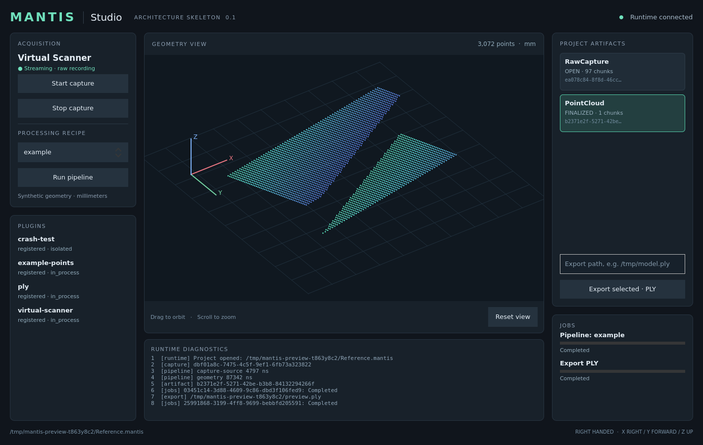

[](https://github.com/martinkoenig/mantis-studio/actions/workflows/build.yml)
[](LICENSE)
[]()

# Mantis Studio — Architecture Skeleton v0.1

An executable validation of the frozen [Mantis Studio Architecture v1](MANTIS_STUDIO_ARCHITECTURE.md).
The daemon owns devices, captures, projects, jobs and plugins. Qt Quick Studio, the C++ CLI and the Python SDK are independent protocol clients.



**This is a development milestone, not production scanner software.** It generates deterministic synthetic images and converts a reference image into a small point cloud. It does not implement Mantis X1 hardware acquisition or reconstruction algorithms.

## Quick start

Install dependencies and build as described in [BUILDING.md](BUILDING.md). From the repository root:

```bash
export MANTIS_TOKEN="$(python3 -c 'import secrets; print(secrets.token_hex(24))')"
export MANTIS_PORT=47321
./build/debug/bin/mantisd --project "$PWD/Demo.mantis" &
./build/debug/bin/mantis-studio
```

Run the UI from the same shell, or export the same token and port in every client shell. Closing Studio leaves `mantisd` and capture running. Use **Stop capture**, then `mantis-cli shutdown`, to shut down cleanly.

```bash
./build/debug/bin/mantis-cli devices list
./build/debug/bin/mantis-cli workflow "$PWD/example.ply"
PYTHONPATH=build/debug/python /usr/bin/python3 examples/python/workflow.py python-example.ply
./build/debug/bin/mantis-cli shutdown
```

Export filenames must not already exist. Exports belong outside the `.mantis` project directory.

## Implemented reference workflow

1. Discover Virtual Scanner through the public device plugin ABI.
2. Start runtime-owned capture with a bounded, lossless recording queue.
3. Journal immutable image chunks outside SQLite.
4. Compile a versioned JSON recipe into a typed execution plan.
5. Process frame zero through the public processing plugin ABI.
6. Finalize a point-cloud artifact with source, recipe, calibration and sequence provenance.
7. Map its immutable data file in the Studio renderer without putting geometry into control messages.
8. Export through the public PLY exporter plugin as a cancellable job.
9. Repeat from CLI/Python, restart Studio, or deliberately crash an isolated plugin host.
10. Restart the daemon after abrupt termination and recover committed capture chunks.

The frame-zero reference is intentional: client timing does not change the demonstration geometry. All acquired frames are recorded for later replay. Full-capture reconstruction is a subsequent milestone.

## Scope and platform status

| Platform | Architectural target | Validation in this delivery | Support commitment |
| --- | --- | --- | --- |
| Linux x86_64 | Yes | Ubuntu 24.04; GCC 13; Qt 6.4; native build and process tests | Skeleton development reference |
| Linux ARM64 | Tier 1 | Native ARM64 GitHub Actions job configured; not executed in this workspace | Must pass CI before binary support is claimed |
| Windows x86_64 | Yes | Platform implementation present; not built/tested here | Not yet supported |
| macOS ARM64 | Yes | POSIX implementation used; not built/tested here | Not yet supported |

No x86 intrinsics or pointer-width assumptions are used in public structures. The current packet codec explicitly supports little-endian targets, including the four target architectures.

## Documentation

- [Build and run](BUILDING.md)
- [Implementation architecture and module map](docs/architecture/implementation.md)
- [Acceptance evidence](docs/architecture/validation.md)
- [Milestone coverage and limitations](docs/architecture/milestone.md)
- [Plugin development](docs/plugin-development/README.md)
- [C++ / Python Client SDK](docs/client-sdk/README.md)
- [Protocol and local data plane](docs/protocol/README.md)
- [Storage and recovery](docs/architecture/storage.md)
- [Architecture Decision Records](docs/adr/README.md)
- [Contributing](CONTRIBUTING.md), [security model](SECURITY.md)

The architecture specification is included unchanged. No production hardware algorithms, GPU backends, marketplace, cloud deployment or mobile application are included.
